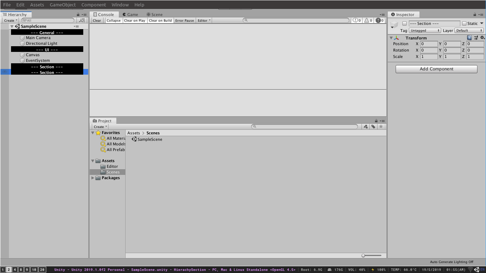
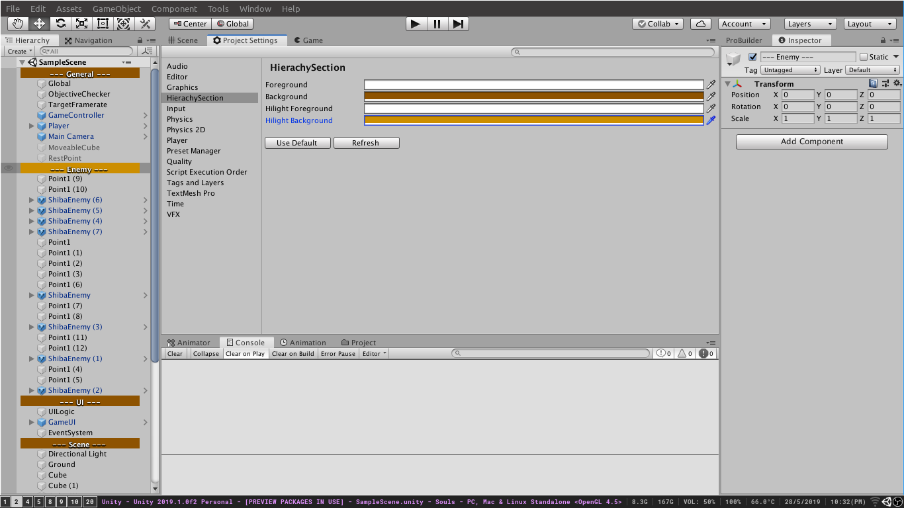

# HierachySection
- Unity custom menu item to create section in Hierachy (empty Game Object with a name "--- Section ---")
- Support rename, automatic adding prefix ("---") when section name has changed.
- Support custom color in project setting (refresh script to see the changes)
- Option to set all section gameobject's tag to 'EditorOnly' (Not include these object in build)

# Getting Started
1) Add all scripts from this Editor folder to your Editor folder
2) Press "Control + T" or Use GameObject menu item to Create Section

# Keybinding
- Control + T : Create section
- Alt + Shift + R : Move gameObject up
- Alt + R : Move gameObject down
- S : Select next section
- Shift + S : Select previous section
- G : Move selected gameobject to current section (downward)
- Shift + G : Move selected gameobject to current section (upward)
- Alt + S : Pin section
- Control + Shift + F12 : Refresh Scripts

